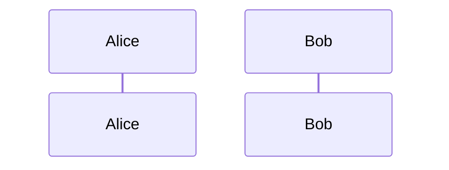

# できたもの

段落１
段落１中の改行

段落２
段落１中の改行

[リンク](#見出し)

> 引用
>
> > 引用

~~このテキストを打ち消し~~


## 見出し 2

index.js

```javascript
function hello() {}
hello();
```

index.php

```php
function hello() {
	return 'Hello! World.';
}

echo hello();

```

UML



Checkbox

- [x] Finish my changes
- [ ] Push my commits to GitHub
- [ ] Open a pull request
