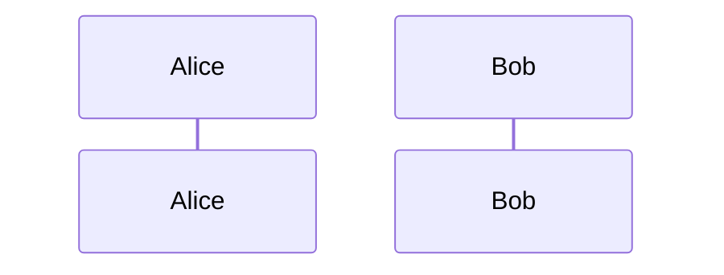

## できたもの

段落１
段落１中の改行

段落２
段落１中の改行

[リンク](#見出し)

> 引用
>
> > 引用

~~このテキストを打ち消し~~

1. list1
1. list1-1
   1. list1-1-1
1. list1-2
   1. list1-2-1
1. list1-3
1. list1-4
   1. list1-4-1
1. list1-5
1. list2
1. list2-1
   1. list2-1-1
1. list3
1. list4

- list1
- list1-1
  - list1-1-1
- list1-2
  - list1-2-1
- list1-3
- list1-4
  - list1-4-1
- list1-5
- list2
- list2-1

  - <div>
    <p>test</p>

  </div>

- list3
- list4


### 見出し 2

index.js

```javascript
function hello() {}
hello();
```

index.php

```php
function hello() {
	return 'Hello! World.';
}

echo hello();

```

index.html

```html
<html>
  <head> </head>
  <body></body>
</html>
```

UML



Checkbox

- [x] Finish my changes
- [ ] Push my commits to GitHub
- [ ] Open a pull request

Keyboard Style

1. Use `{ctrl}`+`{c}` to copy text.
2. Use `{ctrl}`+`{v}` to paste text.
3. Open task manager: `{ctrl}`+`{alt}`+`{del}`
